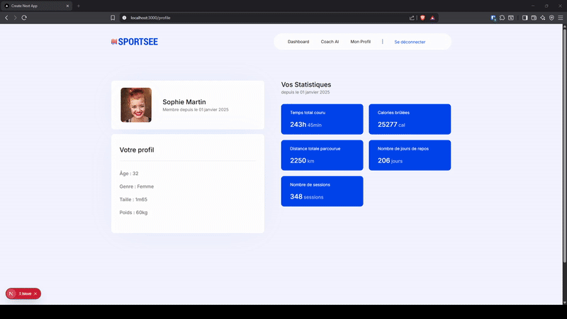
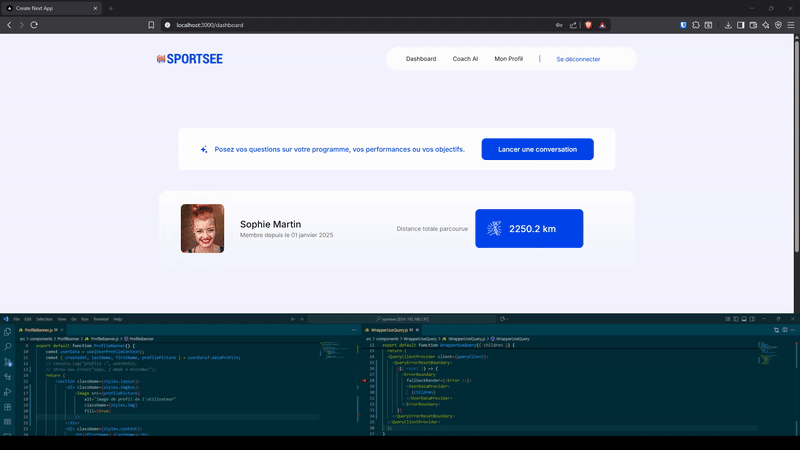

# SportSee - Dashboard Sportif avec IA

## 📋 Présentation du Projet

**SportSee** est une application de coaching sportif développée dans le cadre du projet P6 d'OpenClassrooms. L'application propose un tableau de bord personnalisé permettant aux utilisateurs de suivre leurs performances sportives avec l'assistance d'une intelligence artificielle.

### Contexte du Projet
- **Formation** : OpenClassrooms - Développeur IA
- **Projet** : P6 - Développez un tableau de bord d'analytics avec React
- **Objectif** : Créer une interface utilisateur moderne avec intégration IA pour le coaching sportif

## 🚀 Fonctionnalités Principales

### Dashboard Utilisateur
- **Authentification sécurisée** avec JWT et sessions chiffrées
- **Visualisations interactives** des données sportives (graphiques, statistiques)
- **Profil utilisateur** avec informations personnelles et objectifs
- **Suivi d'activité** hebdomadaire avec métriques détaillées

### Intelligence Artificielle Intégrée
- **Chat IA personnalisé** pour conseils sportifs
- **Analyse des données** d'entraînement en temps réel
- **Recommandations adaptées** basées sur les performances
- **Protection contre l'injection de prompts** et sanitisation des données

## 🛠️ Stack Technique

### Frontend
- **Next.js 14** - Framework React avec App Router
- **React 18** - Bibliothèque UI avec hooks et contextes
- **TanStack Query** - Gestion d'état serveur et cache
- **Recharts** - Visualisations de données interactives
- **CSS Modules** - Styles componentisés

### Backend & Services
- **Next.js API Routes** - Endpoints serveur
- **JWT** - Authentification et autorisation
- **Mistral AI** - Modèle de langage pour le coaching
- **Server Actions** - Actions sécurisées côté serveur

### Sécurité & Performance
- **Rate Limiting** - Protection contre les abus
- **Sanitisation des données** - Prévention XSS et injections
- **Sessions chiffrées** - Sécurité des données utilisateur
- **Middleware de protection** - Routes authentifiées

## 🏗️ Architecture du Projet

```
src/
├── app/                    # App Router Next.js
│   ├── (login)/           # Groupe de routes - Authentification
│   └── (user)/            # Groupe de routes - Utilisateur authentifié
|        ├── dashboard/    # DashBoard route
|        ├── profile/      # Profile route
│        └── api/          # API Routes
├── components/            # Composants React réutilisables
├── context/              # Contextes React (UserContext)
├── hooks/                # Hooks personnalisés
├── lib/                  # Utilitaires et configurations
├── middleware.js         # middleware pour la gestion des routes public et privé
└── services/             # Services API et authentification
```

## 🔧 Installation et Configuration

### Prérequis
- Node.js 18+ 
- Backend API SportSee (port 8000)
- Clé API Mistral AI

### Installation
```bash
# Cloner le repository
git clone [url-du-repo]
cd sportsee

# Installer les dépendances
yarn install

# Configuration des variables d'environnement
touch .env
```

### Variables d'Environnement
```env
SECRET=your-jwt-secret-key
MISTRAL_API_KEY=your-mistral-api-key
```

### Démarrage
```bash
# Développement
yarn run dev
```

## 🎯 Fonctionnalités Clés Implémentées

### Authentification & Sécurité
- **Sessions JWT chiffrées** avec rotation automatique
- **Middleware de protection** des routes sensibles
- **Sanitisation avancée** des entrées utilisateur
- **Rate limiting** par utilisateur

### Gestion des Données
- **Cache intelligent** avec TanStack Query
- **Contextes React** pour le partage d'état
- **Server Actions** pour les opérations sécurisées
- **Validation côté serveur** avec gestion d'erreurs

### Interface Utilisateur
- **Design responsive** adaptatif
- **Graphiques interactifs** avec Recharts
- **Composants modulaires** réutilisables
- **Gestion d'état optimisée**

### Intelligence Artificielle
- **Chat contextuel** avec historique
- **Prompts optimisés** pour le coaching sportif
- **Protection anti-injection** de prompts
- **Réponses personnalisées** basées sur les données utilisateur

## 📊 Composants de Visualisation

### Graphiques Sportifs
- **BarGraph** - Sessions d'entraînement
- **ComposedGraph** - Fréquence cardiaque
- **PieGraph** - Répartition des objectifs
- **StatsGrid** - Vue d'ensemble des métriques

### Cartes d'Information
- **RecapCard** - Résumés de performance
- **AttributesCard** - Statistiques détaillées
- **ProfileBanner** - Informations utilisateur

## 🔐 Sécurité Implémentée

### Protection des Données
- Chiffrement des sessions utilisateur
- Sanitisation automatique des entrées
- Validation stricte des paramètres
- Masquage des données sensibles

### Protection IA
- Détection d'injection de prompts
- Limitation du contexte de requête
- Rate limiting spécifique à l'IA
- Filtrage des réponses générées

## 🚀 Démonstration

### 🛑 Refus hors sujet


La démonstration montre le refus de répondre a une question hors du spectre sportif et condition physique.

### ⏱️ Rate limiting


La démonstration montre la detection et la prise en charge du rate limit.

### 😭 Error Boundaries



La démonstration montre la detection et la prise d'erreur de rendu.

## 📈 Performance & Optimisation

- **Code Splitting** automatique avec Next.js
- **Cache de données** intelligent avec TanStack Query
- **Lazy Loading** des composants
- **Optimisation des images** Next.js
- **Server-Side Rendering** pour le SEO

## 👨‍💻 Développeur

**William Derue** - Étudiant OpenClassrooms  
Développeur IA

---

*Ce projet démontre l'intégration réussie d'une intelligence artificielle dans une application React moderne, avec un focus sur la sécurité, la performance et l'expérience utilisateur.*